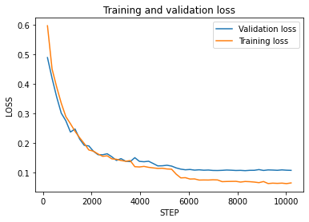
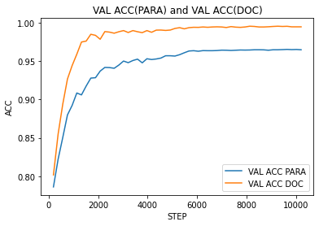

## Installation

### Python Version

- Python == 3.8

### Virtual Environment

#### Windows

- `python -m venv venv`
- `.\venv\Scripts\activate`
- If any problem for scripts activation
  - Execute following command in administration mode
    - `Set-ExecutionPolicy Unrestricted -Force`
  - Later you can revert the change
    - `Set-ExecutionPolicy restricted -Force`

#### Linux

- `python -m venv venv`
- `source venv/bin/activate`

### Library Installation

- Library Install
  - `pip install --upgrade pip`
  - `pip install --upgrade setuptools`

### Colab Setup

- run the following scripts to setup all dependency on colab

```python
import torch

def format_pytorch_version(version):
  return version.split('+')[0]

TORCH_version = torch.__version__
TORCH = format_pytorch_version(TORCH_version)

def format_cuda_version(version):
  return 'cu' + version.replace('.', '')

CUDA_version = torch.version.cuda
CUDA = format_cuda_version(CUDA_version)

!pip install torch-scatter     -f https://pytorch-geometric.com/whl/torch-{TORCH}+{CUDA}.html
!pip install torch-sparse      -f https://pytorch-geometric.com/whl/torch-{TORCH}+{CUDA}.html
!pip install torch-cluster     -f https://pytorch-geometric.com/whl/torch-{TORCH}+{CUDA}.html
!pip install torch-spline-conv -f https://pytorch-geometric.com/whl/torch-{TORCH}+{CUDA}.html
!pip install torch-geometric 

```

## Requirements
 - Python 3.7
 - PyTorch 1.2.0
 - PyTorch Geometric 1.3.2
 - GloVe word embeddings
```
pip install numpy==1.17.2
pip install scikit-learn==0.21.3
pip install torch==1.2.0
pip install --verbose --no-cache-dir torch-scatter==1.3.2
pip install --verbose --no-cache-dir torch-sparse==0.4.3
pip install --verbose --no-cache-dir torch-cluster==1.4.5
pip install torch-geometric==1.3.2
```

## Download Dataset

Bangla news dataset collected from this [link](https://www.kaggle.com/furcifer/bangla-newspaper-dataset).

## Data Generation
Follow the data generation [notebook](data_get/data_gen.ipynb) file to format data from raw news data and pretrained word embedding [glove](https://www.kaggle.com/aminulpalash/bn-glove840b300d) model.
 - example congrent and incongrent dataset format
 ```
 column names = ['id', 'headline', 'body', 'label', 'fake_para_len', 'fake_para_index', 'fake_type']
 ```
 * label = 1 when sample is incongruent
 * label = 0 when sample is congruent
 * fake para index: contains the paragraph index of the news that is inconguent. [0 index]

- Preprocessed dataset can be download from [here](https://www.kaggle.com/aminulpalash/bangla-news-incongruity-detection)

## Preprocess
```
python preprocessing.py --dataset-path bangla_datasets \
                        --glove-path BN_GLOVE/glove.840B.300d.txt
```
## Train
```
python train.py --processed-data-path bangla_datasets/processed \
                --lr 0.001 \
                --batch-size 120 \
                --min-iterations 50000 \
                --train \
                --eval \
                --para-level-supervision True \
                --edge-supervision True \
                --save-checkpoint
```
## Test

```
python inference.py --model_path 'saved/ckpt_ghde_2021-08-05_11 09 48.476392.pt' \
                    --input_file_path test.tsv \
                    --glove_voca_path voca.pkl
                    --glove_path saved/voca_glove_embedding.npy
```
## Evaluation graph
Validation and training loss (left), validation accuracy for paragraph and pocument (right).
<p float="left">
  
    
</p>
